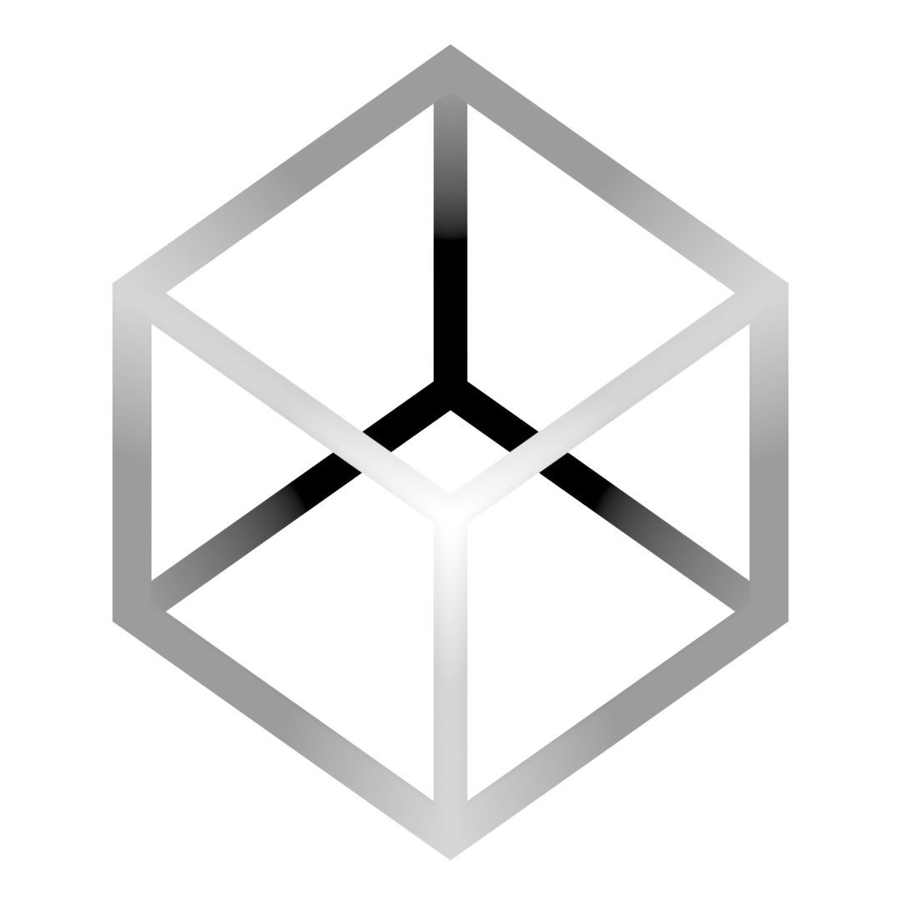

# Renderium

`Renderium` is cross-platform, modern graphics API that can translate your gpu instructions to the optimal underlying graphics API. The library also has a modular structure which allows for custom shading languages and the customization of other parts. `Renderium` is extremely similar to the WebGPU standard making it effortless for WebGPU users or for people beginning with graphics. 

*!!!This project is currently in development!!!*
 

## Currently supported backend graphics API
> * Vulkan

This graphics API's main shading language is `slang`, which is great because `slang` is cross-platform and flexible, making it easy to learn and convert your old shaders to it.

## Updates?

`Renderium` is getting updates regularly.

Right now, this project is a work in progress that will later work in hand with `Obsidium` to act as the graphical backend.
